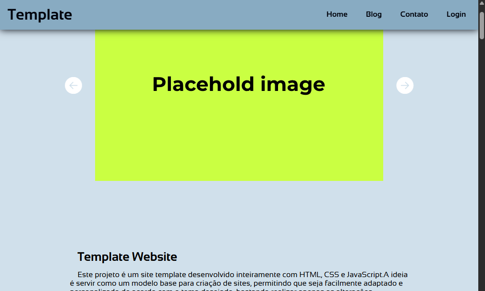

 

# template-website

> Este projeto é um template moderno para criação de sites, desenvolvido inteiramente com HTML, CSS e JavaScript puro.
> A proposta é oferecer uma base simples, organizada e responsiva, que pode ser reutilizada e adaptada para diferentes tipos de páginas.v
> O foco deste projeto é treinar habilidades em desenvolvimento front-end utilizando apenas tecnologias puras, sem o auxílio de frameworks ou bibliotecas externas de estilização.

## Tecnologias

## Contribuir

1. **Clonar projeto:**: `git clone https://github.com/guicarbar/template-website?tab=readme-ov-file`
2. **Criar feature/branch:**: `git checkout -b feature/Nome-da-branch`

## Créditos e Inspiração 

> O design e a estrutura foram inspirados em templates modernos encontrados no GitHub e também em ideias extraídas da plataforma [v0](https://v0.app/)

## Licença

Este projeto está sob a licença [MIT](../LICENSE) License.